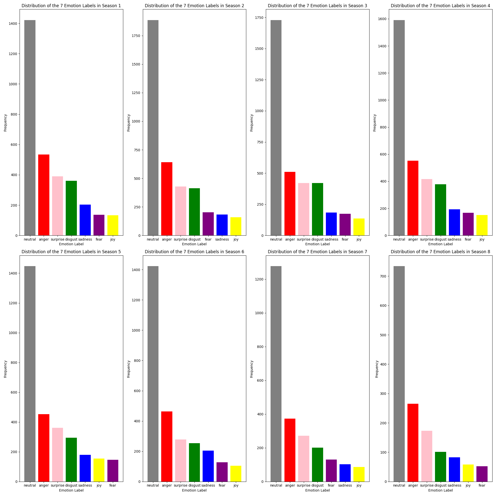
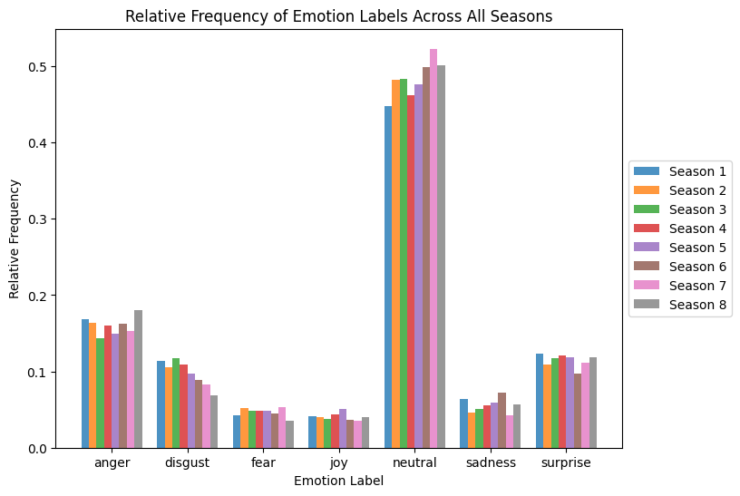

# Assignment 4: Emotion Analysis with Pretrained Language Models
This repository contains a Python script designed to perform emotion analysis on the scripts of the television show 'Game of Thrones' using pretrained language models. Additional functionality for measuring and extracting environmental impact of the code with `CodeCarbon` is also present within the script.

More specifically, the repository includes the main Python script, the output CSV file containing the emotion analysis results, various plots along with CodeCarbon emission CSV files, and other relevant files for setting up and running the script (for further details, see *Repository structure*).

### Task Overview
For this assignment, the primary aim was to analyse the Game of Thrones scripts (see *Data Source*) to determine the emotional profile across its seasons. The code had to be able to do the following:  
1. Predict emotion scores for all lines in the data.
2. For each season:
    - Plot the distribution of all emotion labels.
3. For each emotion label:
    - Plot the relative frequency across all seasons.
4. Add `CodeCarbon` functionality to track and measure the environmental impact of the code. 

### Repository Structure
Below is the directory structure of the repository. Make sure to have a similar layout for easy navigation and reproducibility purposes.  
```
.
Assignment_4/
│
├── in/
│   └── Game_of_Thrones_Script.csv
│
├── out/
│   ├── emissions_base_31ed882d-1df4-4cab-8da4-59f7a31cda30.csv
│   ├── emissions.csv
│   ├── Emotion_Analysis_Output.csv
│   ├── emotions_seasons.png
│   ├── relative_frequency_emotions.png
│
├── src/
│ └── main.py
│
├── README.md
├── requirements.txt
├── run.sh
└── setup.sh

```

## Data Source
The data used for this assignment is the scripts from the TV-series Game of Thrones. Specifically, the scripts for every season have been collected into one complete set in the form of a table, split into lines, with metadata such as who spoke each line, which episode that line comes from, and which season that episode belongs to.

For more details about the data visit the following [website](https://www.kaggle.com/datasets/albenft/game-of-thrones-script-all-seasons?select=Game_of_Thrones_Script.csv). To use the data, simply follow the link, download the dataset, and save it to the `in` folder.

## Steps for Re-running the Analysis
### Setting Up and Running the Code
To re-run the analysis, follow the steps outlined below:

**1. Download and Prepare the Repository:**  
If the attachment has not already been downloaded and unzipped, then start by downloading the zip file and unzip it in your desired location. When done, navigate to the `Assignment_4` folder.  
(Ensure that the 'Game_of_Thrones_Script' dataset is downloaded and placed in the `in` folder, as specified above.)

**2. Set Up the Virtual Environment:**  
Execute the following command in your terminal to set up the Python virtual environment and install the needed dependencies.
```
bash setup.sh 
```

**3. Activate the Virtual Environment and Run the Code:**  
Run the script by executing the following command in your terminal. It will activate the virtual environment, run the Python script with the command line arguments that you provide, and then deactivate the environment when finished.
```
bash run.sh --dataset_path=./in/Game_of_Thrones_Script.csv --output_dir=./out
```

### Command Line Arguments
These are the arguments that can be passed:  
**--dataset_path:** Path to the dataset file containing the CSV file.  
**--output_dir:** Directory where the results CSV file, plots, and emission files will be saved, defaults to `../out`.   

## Summary of Key Points from Outputs
The outputs for the emotion analysis are presented below.

**Distribution of Emotions per Season:**  
  

The bar plot displays the frequency of each emotion label for each season, where the 'neutral' emotion is the most prevelant one in each season by a notable amount. This result could suggest that much of the dialogue does not convey pronounced emotion. An instance of such a case can be seen in 'Emotion_Analysis_Output.csv' line 4555: "My name is Daenerys-", neutral. Notably, 'anger', 'surprise', and 'disgust' are also prevelant throughout the different seasons. While these three emotions, along with the 'neutral' one, are consistently shown as the top four, the last three emotions do vary from season to season.

**Relative Frequency of Emotions Across Seasons:**  


This bar plot shows the frequency of each emotion label across all seasons, where the 'neutral' emotion can again be seen to be the most prevelant emotion. Moreover, 'anger', 'surprise', and 'disgust' are again among the other most frequent emotions across seasons. However, all emotions vary in frequency across the seasons, with such changes perhaps correlating to the different plot events and changing tone settings.  

Overall, this analysis indicates that 'Game of Thrones' stays quite consistent in the conveyed emotional profile across seasons.

## Discussion of Limitations and Possible Steps for Improvement  
This script provides insights into the emotional profile of 'Game of Thrones' across its seasons using a pretrained language model. However, certain limitations should be considered to further enhance the analysis.

First of all, it should be noted that the model's predictions are limited to the textual data and lack the nuances and "depth" of human context recognition. For instance, within the dataset are lines that could arguably be viewed as conveying an emotion, which the model simply classifies as 'neutral'. A specific example can be seen in 'Emotion_Analysis_Output.csv' line 2065: "The lion's not his sigil, idiot. He's a stag, like his father.", neutral. This line, in context of the scene, could instead be seen as the character (i.e., Arya Stark) showing *anger* or frustration towards her sister (i.e., Sansa Stark), but it is classified as 'neutral'. This may suggest that the language model (i.e., `j-hartmann/emotion-english-distilroberta-base`) is not "sensitive" enough, or, more likely, that because it cannot process the context of scenes as a whole it struggles to accurately classify all lines. To address this implementations of methods to provide the model with more context, such as including the previous and next lines of dialogue, could help improve the classification of emotions.

Another limitation is that the script processes lines sequentially, which may not be efficient for larger datasets, such as the one used for this assignment. Implementing parallel processing could therefore reduce computation time and speed up the analysis.

In short, while the current script effectively extracts and visualises the emotional profile of the 'Game of Thrones' scripts, addressing these limitations and implementing suggested improvements could lead to a more robust and insightful analysis.

## CarbonCode Tracking
As mentioned earlier, `CodeCarbon` has been implemented to measure and extract the environmental impact that the code had while running. Multiple CSV files containing information pertaining to this are therefore also present in this repository.  

For a detailed analysis of these results along with results for the other assignments, see `Assignment 5`.

## Acknowledgements
For this assignment, the author thanks Sabrina Zaki Hansen and Katrine Munkholm for their helpful input on plotting structure.