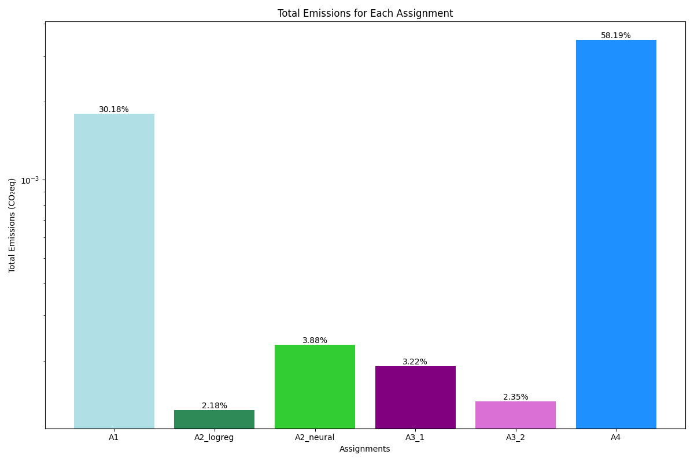
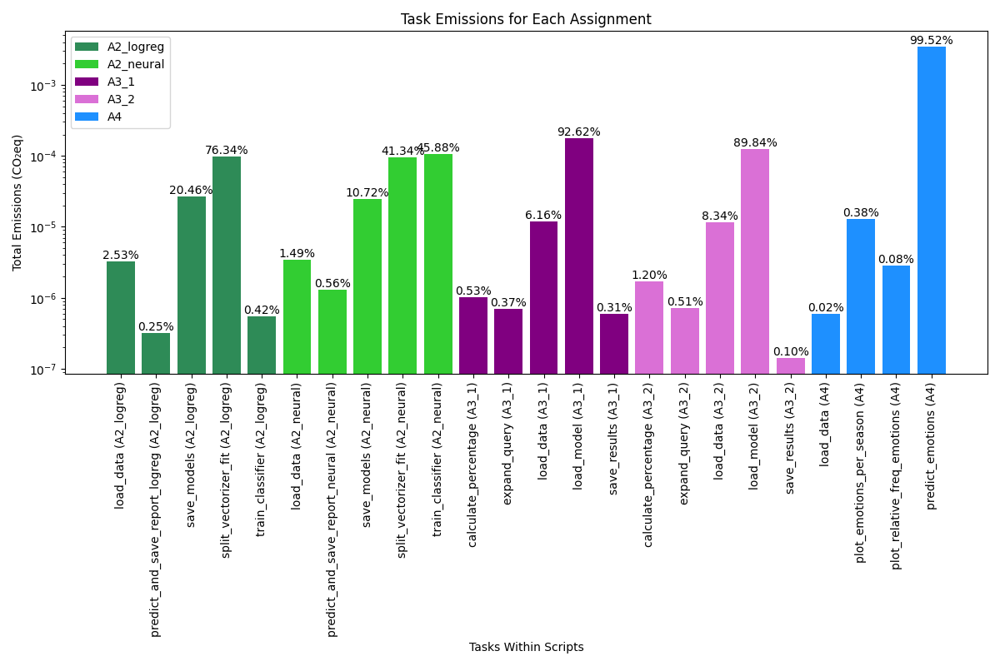
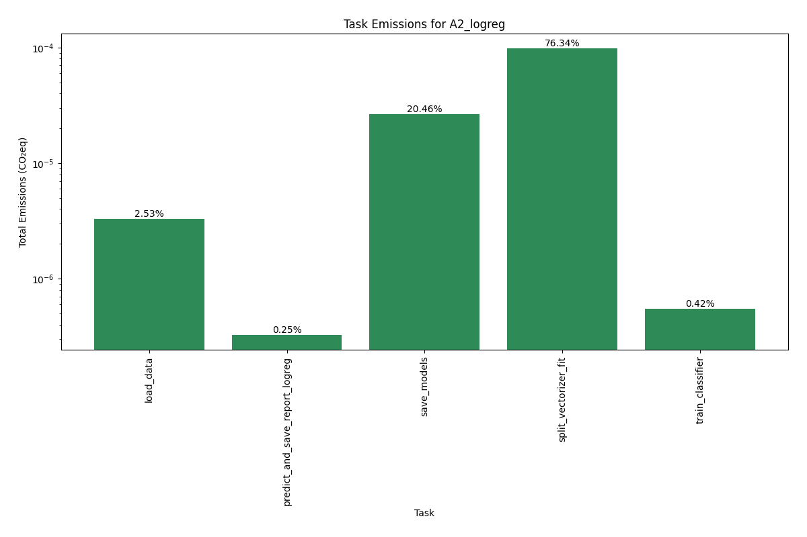
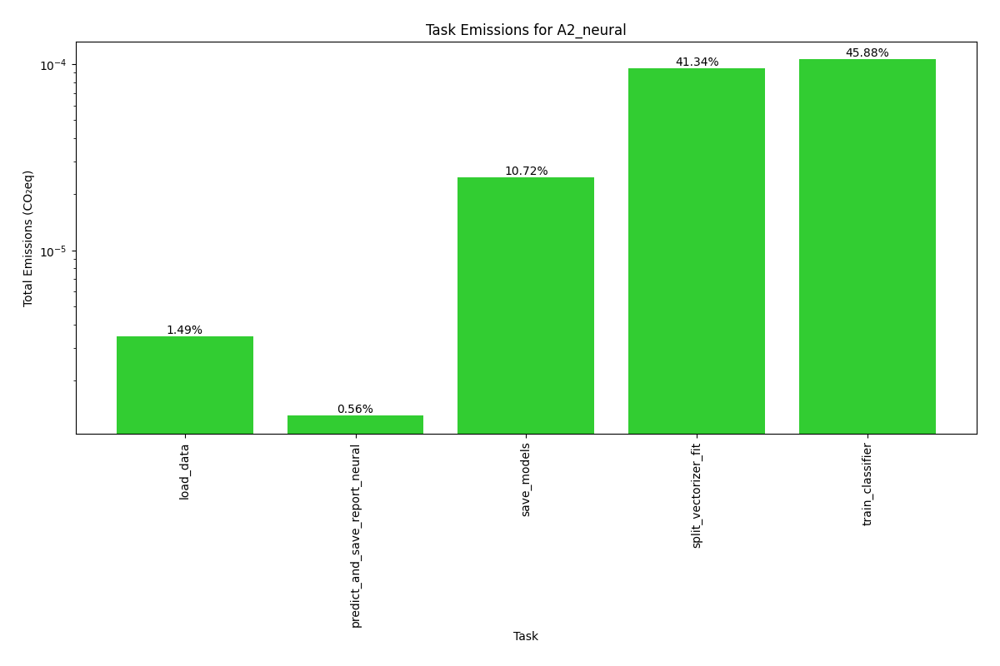
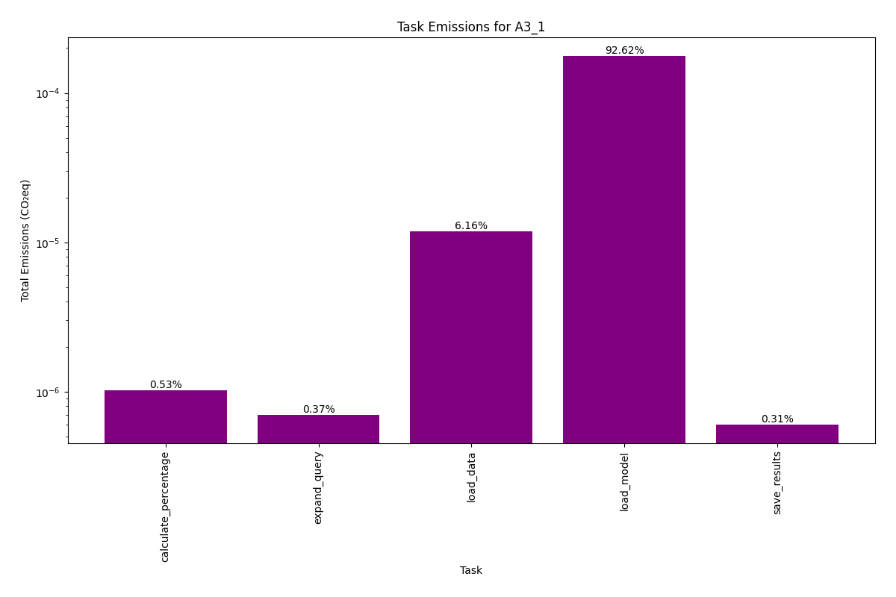
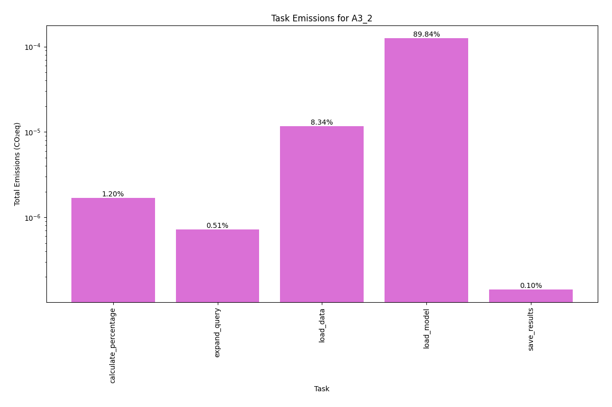
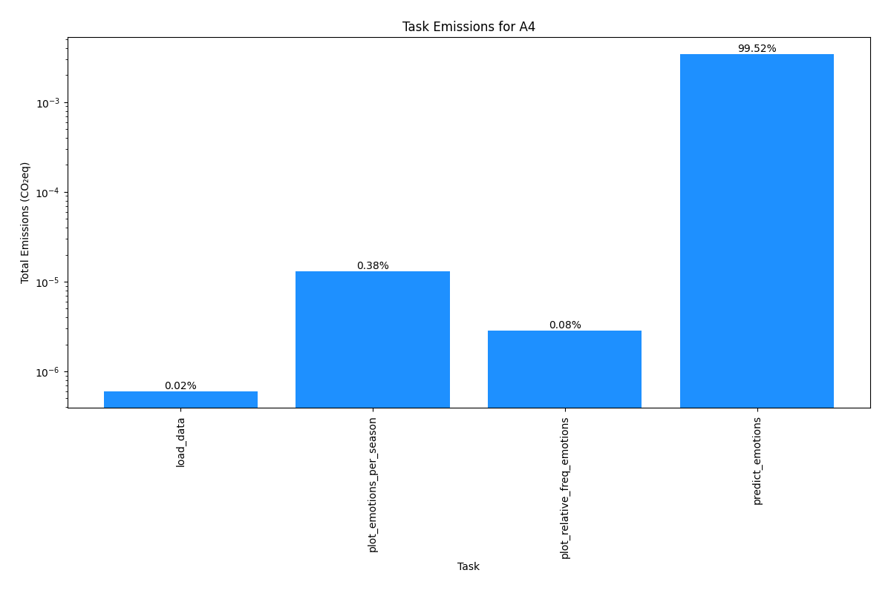

# Assignment 5: Evaluating Environmental Impact of Your Exam Portfolio
This repository contains a Python script designed to evaluate the environmental impact of previous assignments in the Language Analytics course. Using `CodeCarbon`, the script measures the CO₂eq emissions generated by the code from the assignments and provides visualisations of these emissions.

More specifically, the repository includes the main Python script, the output plots, and other relevant files for setting up and running the script (for further details, see *Repository structure*).

### Task Overview
For this assignment, the primary aim was to assess the environmental impact of the code used in all four previous assignments from the Language Analytics course. The code had to be able to do the following:  
1. Measure the total CO₂eq emissions for each assignment.
2. Identify which assignment generated the most emissions.
3. Identify which specific tasks within each assignment generated the most emissions.
4. Provide visualisations of the emissions data.
5. Discuss the robustness of the results and suggest possible improvements.

### Repository Structure
Below is the directory structure of the repository. Make sure to have a similar layout for easy navigation and reproducibility purposes.  
```
.
Assignment_5/
│
├── in/
│   ├── A1_emission.csv
│   ├── A2_logreg_emission.csv
│   ├── A2_neural_emission.csv
│   ├── A3_1_emission.csv
│   ├── A3_2_emission.csv
│   ├── A4_emission.csv
│
├── out/
    ├── A2_logreg_task_emissions.png
│   ├── A2_neural_task_emissions.png
│   ├── A3_1_task_emissions.png
│   ├── A3_2_task_emissions.png
│   ├── A4_task_emissions.png
│   ├── total_emissions_by_assignment.png
│   ├── task_emissions_combined.png
│
├── src/
│   └── main.py
│
├── README.md
├── requirements.txt
├── run.sh
└── setup.sh
```

## Data Source
The data used for this assignment is the emission CSV files generated by `CodeCarbon` for each of the previous assignments. These files contain information about the CO₂eq emissions for each task within the assignments, except for `Assignment_1` which has only the total amount.  

To use the data, navigate to the `in` folder and unzip the data to that folder.

## Steps for Re-running the Analysis
### Setting Up and Running the Code
To re-run the analysis, follow the steps outlined below:

**1. Download and Prepare the Repository:**  
If the attachment has not already been downloaded and unzipped, then start by downloading the zip file and unzip it in your desired location. When done, navigate to the `Assignment_5` folder.  
(Ensure that the CSV files are unzipped and placed in the `in` folder, as specified above.)

**2. Set Up the Virtual Environment:**  
Execute the following command in your terminal to set up the Python virtual environment and install the needed dependencies.
```
bash setup.sh 
```

**3. Activate the Virtual Environment and Run the Code:**  
Run the script by executing the following command in your terminal. It will activate the virtual environment, run the Python script with the command line arguments that you provide, and then deactivate the environment when finished.
```
bash run.sh --dataset_path=./in --output_dir=./out
```

### Command Line Arguments
These are the arguments that can be passed:  
**--dataset_path:** Path to the directory containing the CSV files.  
**--output_dir:** Directory where the plots will be saved, defaults to `../out`.   

## Summary of Key Points from Outputs
The outputs for the emissions analysis are presented below.  

**Total Emissions for Each Assignment:**  
  

This bar plot displays the total CO₂eq emissions (logscaled) for each assignment. Note that both A2/`Assignment 2` and A3/`Assignment 3` have two separate emission files (i.e., A2 has one for each classifier and A3 has one for each word). However, among the assignments, A4 or `Assignment 4` was the assignment which was most resource-intensive in terms of emission output. The percentages shown display the contribution of each assignment toward the overall emissions. These percentages also show that A4, with 58.19% of the emissions, contributed the most, followed by A1/`Assignment 1` with 30.18% of the emissions. This seems appropriate given how A4 involves running a pre-trained language model to perform emotion analysis on the entire 'Game of Thrones' script, which is computationally intensive. The use of the `j-hartmann/emotion-english-distilroberta-base model` for emotion classification requires notable processing power and time to analyse each line of the script, contributing to the high emission output.

**Task Emissions for Each Assignment (Combined):**  
  

This plot shows the emissions for each task within all assignments combined, with A1 excluded, where the percentages indicate the contribution of each task within an assignment to the total emissions of that assignment. Here it is illuminated which specific tasks were the most resource-intensive within the respective assignments.  

For instance, within the A2 logistic regression script, the 'split_vectorizer_fit' function stands out as being responsible for 76.34% of the total emissions. In the A2 neural network script, the 'split_vectorizer_fit' function and the 'train_classifier' function both generated above 40% of the emissions.

For A3_1 and A3_2, the 'load_model' task contributes 92.62% and 89.84% of the emissions, respectively. This indicates how high the resource demands of loading large models are.

In the most resource-intensive script, A4, the 'predict_emotions' function is responsible for 99.52% of the emissions, reflecting the extensive computations required to analyse the entire 'Game of Thrones' script using a pre-trained language model. 

Notably, data-loading tasks for the assignments were not a very large contributor towards overall emissions.  

**Task Emissions for Individual Assignments:**  
Each assignment also has an individual plot showing the emissions (logscaled) for its tasks:
  
  
  
  
  

## Discussion of Limitations and Possible Steps for Improvement  
The script provides insights into the environmental impact of assignments 1-4, yet there are limitations and potential improvements to consider before drawing any final conclusions about the CO₂eq emissions for each assignment.

Firstly, it is important to note that the emission estimates provided by CodeCarbon are approximations. Based on the information from their [website](https://mlco2.github.io/codecarbon/methodology.html), the accuracy of these estimates depends on various factors such as the energy consumption metrics available from the hardware and the carbon intensity of the electricity used. 

Additionally, the comprehensiveness of the analysis should be considered. The current setup measures emissions at the script level and, for assignments 2-4, at the task level. However, the complexity and resource intensity of the different parts of the code vary significantly, and while the task level measurements provide more information on the resource-heavy parts of a script, they still lack finer detail. For instance, the 'predict_emotions' function in A4 is identified as the most resource-intensive task, contributing 99.52% of the total emissions for that assignment, but it is not immediately clear why that is. Manual inspection of the function and knowledge regarding coding and the specific script is needed for that. Consequently, to provide a more detailed understanding and improve upon resource-intensive areas in the code, the relevant `CarbonCoding` code could be expanded to measure emissions in individual function calls or loops within the tasks.

In short, while the current script effectively measures and visualises the environmental impact of the assignments, addressing these limitations and implementing the suggested improvements could lead to a more accurate and robust analysis of the environmental impact the different assignments had.